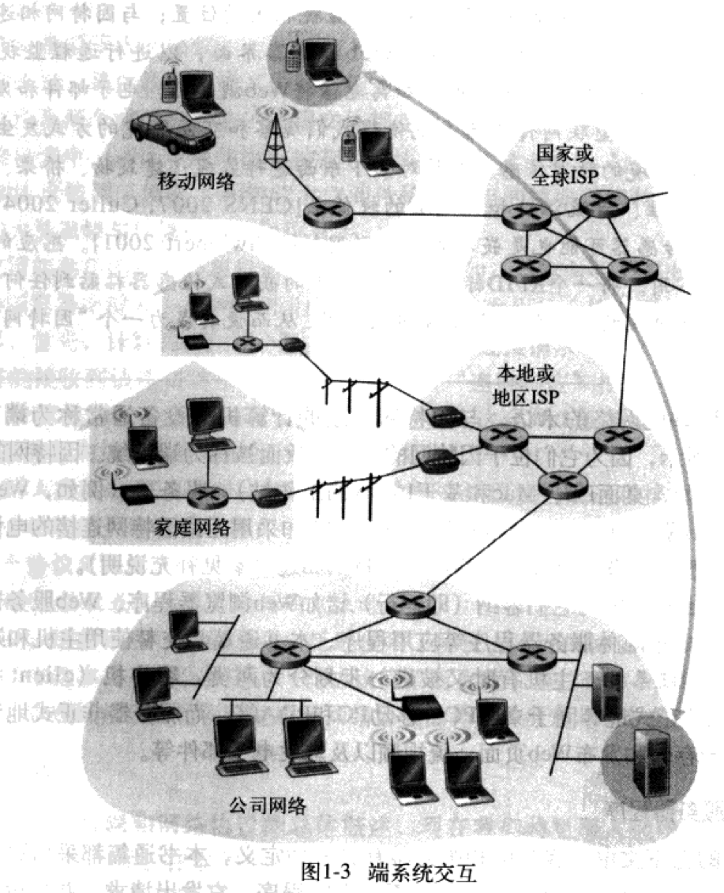

## 因特网

>   两个描述：
>
>   有基本硬件和软件组件组成
>
>   因特网是一种基础设施，向端系统的分布式应用程序提供服务

### 协议

在因特网中，任何两个以上的端系统进行数据交换需要遵守的规则

定义了在两个以上的通信实体之间减缓的报文格式与次序，以及在报文传输，其他事情上采取的动作

### 客户机与服务器程序

主机 = 端系统

客户机——服务器程序模式最为流行的结构

采用此模式的应用程序为分布式应用程序

### 接入网

是将端系统与边缘路由器连接的物理链路

边缘路由器是端系统与远端端系统连接路径上的第一台路由器(类似家用路由器)

#### 住宅接入

通过拨号调制模拟器与住宅的 ISF (图像信号处理技术)相连

