## 什么是计算机网络

>   将一些可以传递信息的硬件通过网络连接起来，所组成的网络
>
>   不仅是软件概念，还包括硬件设备
>
>   不仅是信息通信，支持应用

### 分类

#### 作用范围分

-   广域网（WAN)   方圆几十到几千公里   跨省跨国
-   城域网（MAN)     方圆5千米到50千米   城市间
-   局域网（LAN)       1千米以内的地区内，家庭

#### 使用者分

-   公用网络
-   专用网络

### 计算机的历史

-   第一阶段：单个网络（美国军方）

    通过交换机将多个端系统（主机）相连接

-   第二阶段：三级结构互联网

    树状网络（图）

-   第三阶段：多层次   ISP 互联网

     ISP（Internet Service Provider)  网络服务提供商  （中国电信，中国移动， 中国联通等）

    各个国家地区的ISP彼此连接

    每个ISP（中国移动） 与自身地区ISP（北京移动）相连接

    地区ISP与客户网络相连接（校园，公司，小区等）（图）

    #### 现代互联网的主要线路

    海底电缆

  
  

#### 中国互联网的历史

-   1980年互联网实验
-   1989年公共网络
-   1994年接入国际互联网

>   **国家级ISP:：**中国电信，联通，移动互联网，中国教育与科研计算机网，中国科学技术网

通过这五个网络与世界网络连接，访问外网

## 层次结构

### 层次设计的基本原则

>   分层实现不同的功能

-   保证数据通路顺畅
-   目的计算机状态
-   识别目的计算机
-   数据是否错误

数据交换实现的条件：网络应用数据，数据可靠通信，物理网络接入

-   各层之间是相互独立的
-   每一层要有足够的灵活性
-   各层之间完全解耦

### OSI七层模型

>   OSI并未成为全球标准，TCP/IP在全球范围成为标准
>
>   OSI自身的缺点导致未成功
>
>   OSI制定周期过长，设备无法及时进入市场
>
>   自身功能存在重复

-   应用层————为计算机用户提供接口和服务
-   表示层————数据处理（编码解码，加密解密等）
-   会话层————管理（建立，维护，重连）通信会话
-   传输层————管理端到端的通信连接
-   网络层————数据路由（决定数据在网络的路径）
-   数据链路层——管理相邻节点之间的数据通信
-   物理层————数据通信的光电物理特性

### TCP/IP四层模型

-   应用层(对应OSI的应用层，表示层，会话层)——HTTP/FTP/SMTP/POP3协议
-   传输层————TCP/UDP协议
-   网络层————IP/ICMP协议
-   网络接口层(对应OSI的数据链路层，物理层)——Ethernet/ARP/RARP/PPP协议

## 网络拓扑

>   **网络拓扑**，不关心事物的大小，形状，物理属性，互相的比例关系，以图的形式，通过点，线表示一定范围内多个物体之间的关系

### 边缘部分

>   家庭，学校等端系统

-   一些端系统（主机）与路由器相连接
-   路由器与网关相连接
-   网关与地区ISP相连接

>   企业

-   企业的端系统（包括路由器）与网关网络相连接（由多个网关彼此连接组成）
-   网关网络与统一网关相连接，再连接到地区ISP

### 核心部分

-   各个地区的ISP与主干ISP相连接（例如：东北三省ISP都与东北总ISP连接）
-   各地区的ISP与国际路由器相连接，国际路由器与其他国家地区相连接

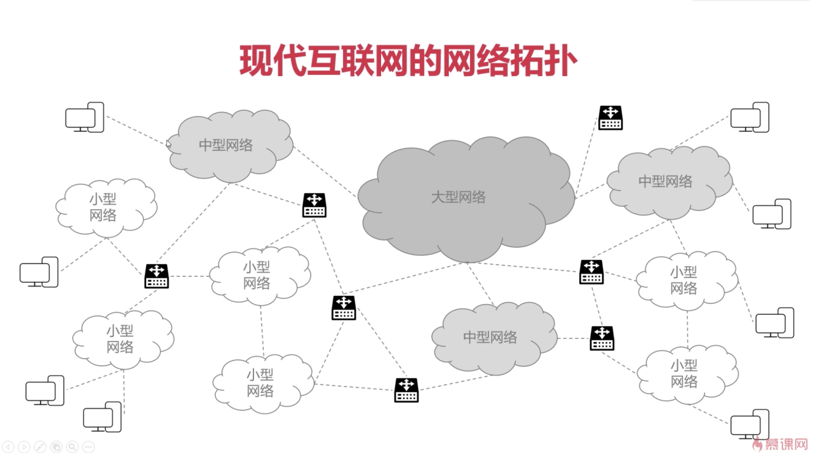

**C/S**

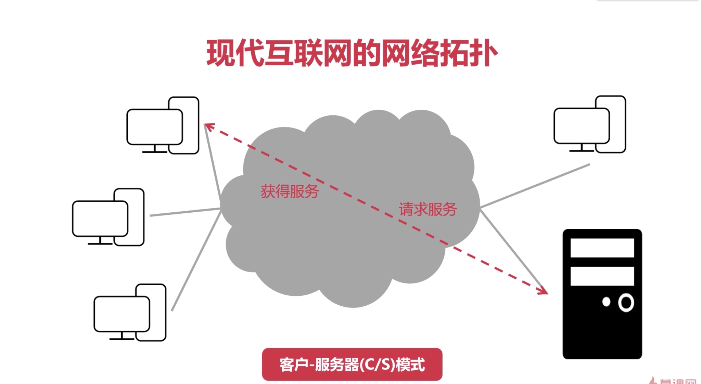

**P2P**

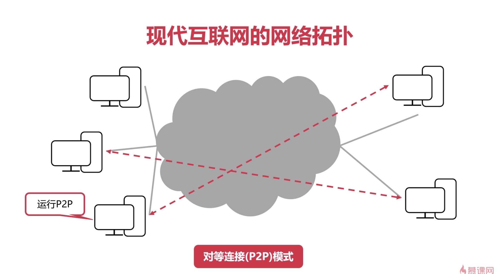

## 计算机网络的性能指标

>   速率 bps = bit/s    比特

### 时延

>   总时延 = 发送时延 + 传播时延 + 排队时延 + 处理时延
>

-   发送时延 = 数据长度(bit) / 发送速率(bit/s)
-   传播时延 = 传输路径距离/传播速率(bit/s)
-   排队时延  = 数据包再网络设备中等待被处理的时间
-   处理时延 = 数据包到达设备或者目的机器被处理所需要的时间

### 往返时间RTT（Route-Trip Time）

>   评估网络质量的指标
>
>   表示数据报文再端到端通信中的来回一次的时间
>
>   通过使用ping命令查看RTT

## 物理层概述

位于TCP/IP四层模型中的网络接口层

### 作用

>   连接不同的物理设备
>
>   传输比特流

通过双绞线，分无屏蔽双绞线，屏蔽双绞线，同轴电缆,   光纤（包层，纤芯），红外线，无线，激光

#### 比特流

>   由 0 1 组成的数字流
>

#### 物理特性

## 信道的概念

>   信道是单方向传送信息的媒体
>
>   一条通信电路包含一个接收信道和一个发送信道

### 信道的分类

-   单工通信信道

    只能单方向，有线电视，无线电收信机

-   半双工通信信道

    双方都可以发送接收信息，但不可同时发送与同时接受

-   全双工通信信道

    双方都可以发送接收信息，也可同时发送与同时接受（已普及）

### 分用--复用技术

（图）（图）

## 数据链路层概述

>   位于网络层次中的网络接口层

### 封装成帧

>   帧  是数据链路层数据的基本单位
>
>   发送端在网络层的一段数据前后添加特定标记形成    帧
>
>   接收端根据前后特定标记识别出    帧
>
>   帧首部    帧尾部    是特定的控制字符

数据在数据链路层的表现形式

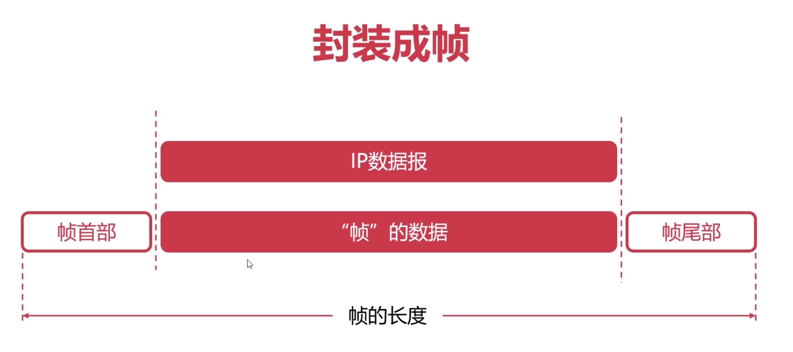

### 透明传输

>   透明    ，即是控制字符在帧数据中，但是要当左不存在去处理
>
>   当数据中出现了    控制字符    
>
>   对控制字符中做处理
>
>   在前加 ESC即可，   当数据本身出现ESC时， 在前面加ESC即可

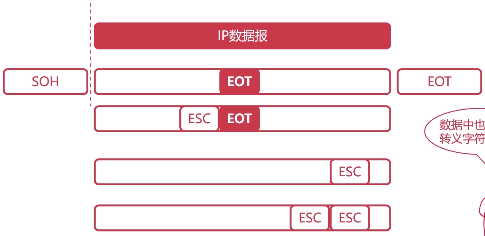

### 差错检测

>   物理层只管传输比特流，无法控制是否出错
>
>   数据链路层负责“差错检测”
>
>   **检测数据从发送方到接受方是否出现错误**

#### 奇偶校验码

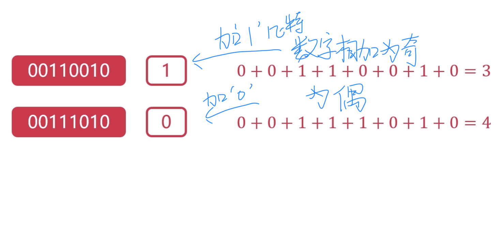

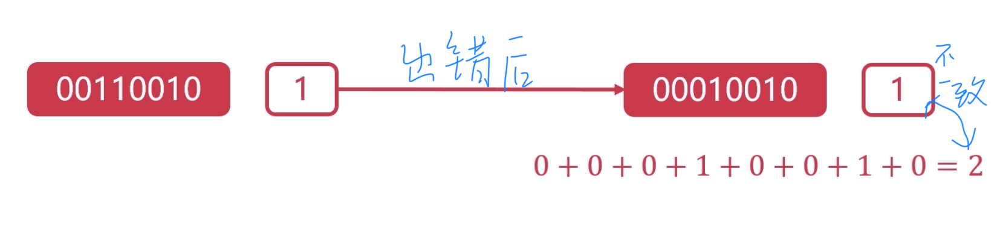

**出错数是偶数时，则无法检测错误**

#### 循环冗余校验码CRC

-   一种根据传输或保存的数据而产生固定位数校验码的方法
-   检测数据传输或者保存后可能出现的错误
-   生成的数字计算出来并且附加到数据后面
-   只是检测是否出错，不进行纠正

##### 通过模“2”除法

是二进制除法，但不能借位，实际是“异或”操作

同为0 ， 异为1

>   0  xor  0 = 0
>
>   0 xor    1 = 1
>
>   1  xor    1 = 0
>
>   不够4位用0添加

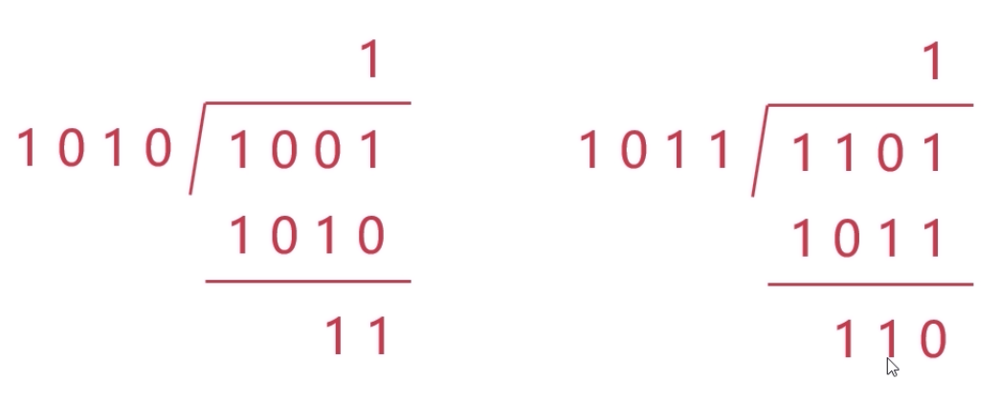

##### 循环冗余校验码CRC步骤

-   选定一个用于校验的多项式G(X)，并在数据尾部添加 r 个  0（检测能力与  r  有关）
-   将添加 r 个  0的数据，使用模 “2” 除法除以多项式的位串
-   得到的余数填充在原数据  r 个  0 的位置得到可校验的位串

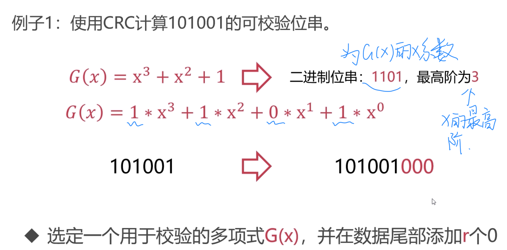

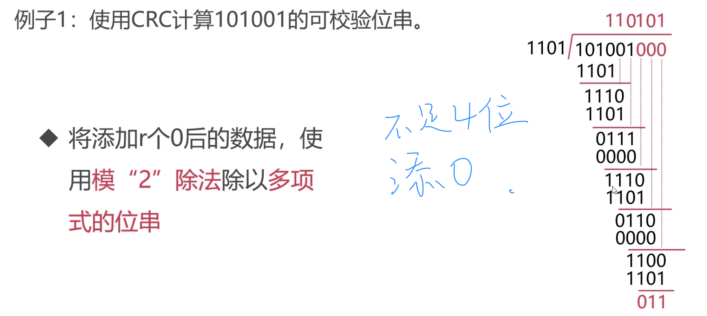

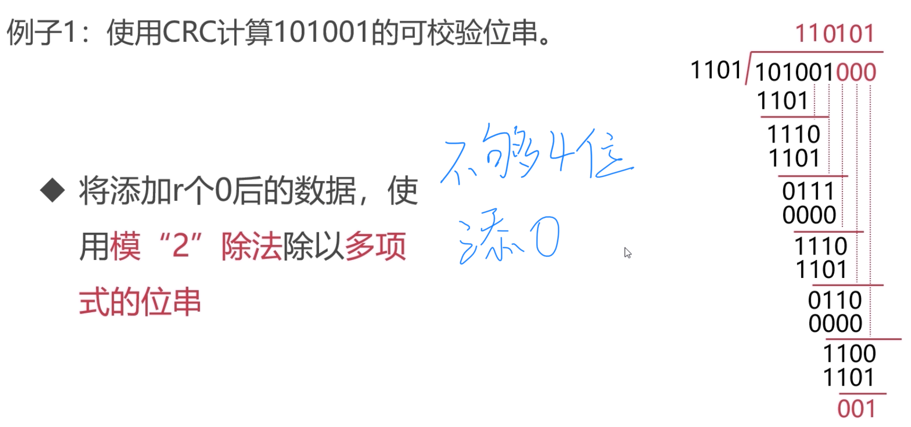

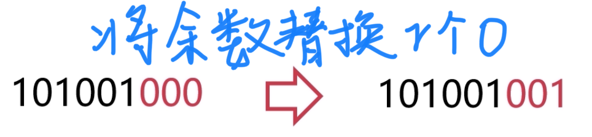

发送端将数据流经过**循环冗余校验码CRC**处理后，发给接收端，接收端将接收数据除以G(X)的位串，根据余数判断对错

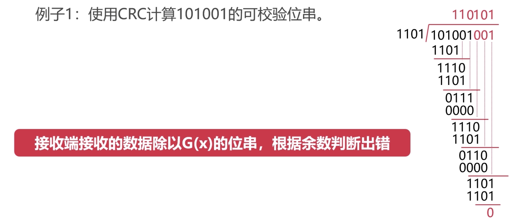

常用CRC

## 最大传输单元MTU

### MTU

-   数据链路层所能传输的最大数据帧，受MTU限制
-   数据帧过大过小都会影响传输效率
-   过大时，增加了时延（发送，排队，传播，处理时延）
-   过小时，增加发送次数，总时延也会增加
-   以太网MTU一般为1500字节

### 路径MTU

数据传输中，受最小的MTU影响（木桶效应）

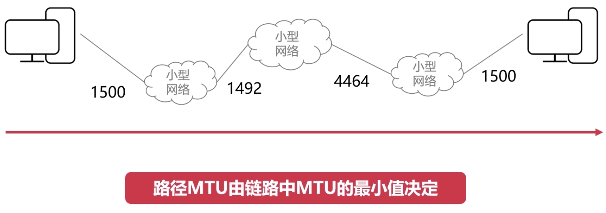

## 以太网协议

### MAC地址

-   MAC地址是物理地址，硬件地址（每个设备唯一）
-   共48位，使用十六进制
-   在命令行中输入 ipconfig/all    可以查看计算机所有设备的地址
-   例如：30-B4-9E-ED-85-CA

### 以太网协议

-   以太网是一种使用广泛的**局域网**技术
-   一种应用于数据链路层的协议
-   使用以太网可以完成**相邻设备**的数据帧传输

#### 组成

>   目的地址，源地址，类型，帧数据的大小范围，CRC

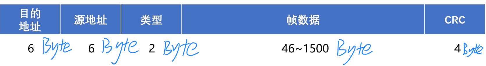

#### MAC地址表

将MAC地址映射到具体硬件接口上

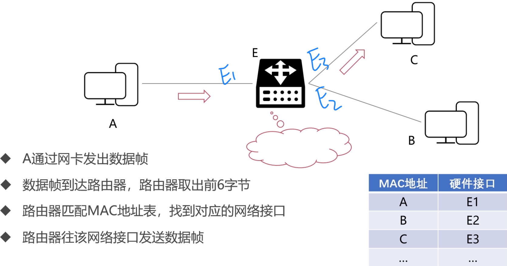

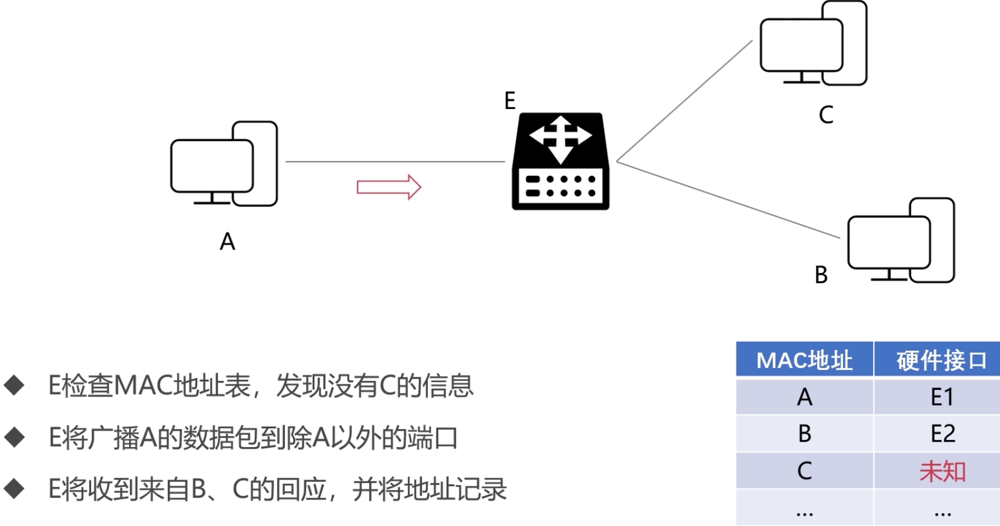

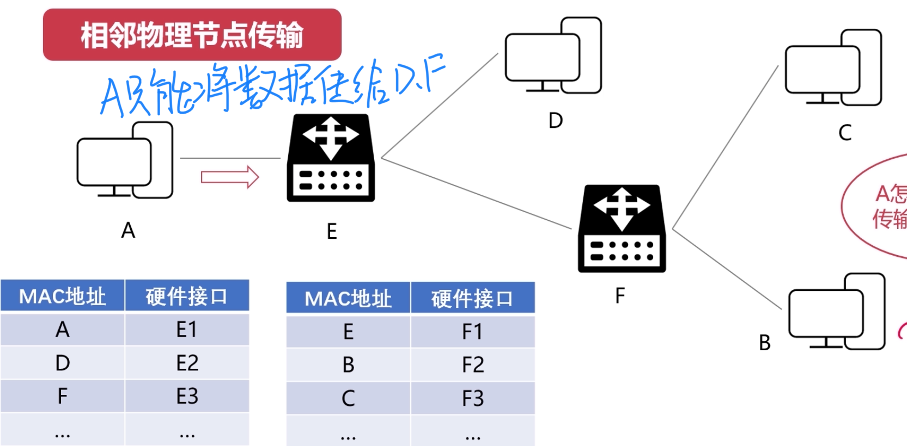

>   **跨节点传输要在网络层解决**

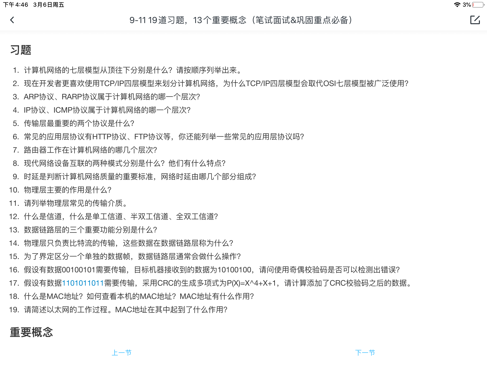

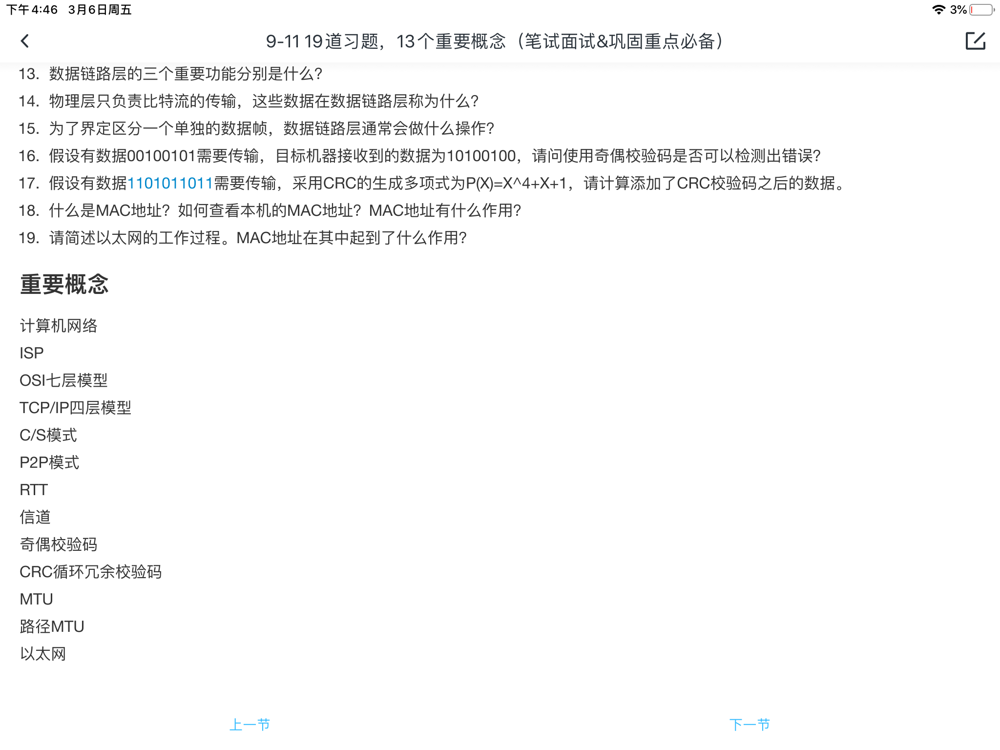
