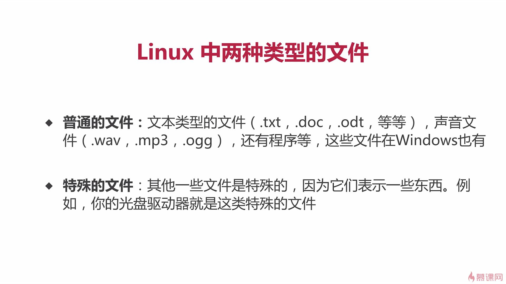
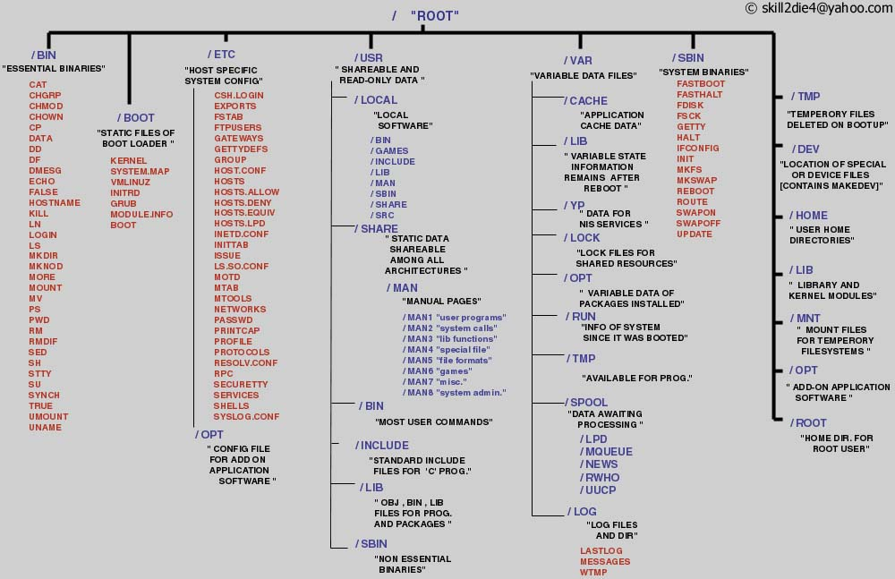
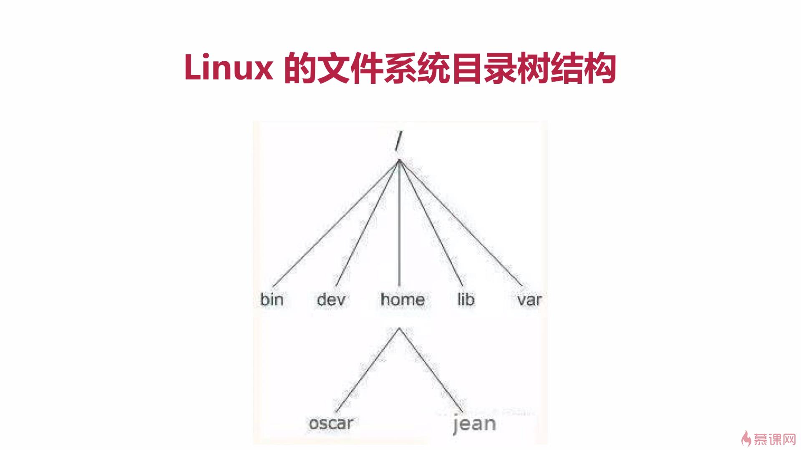
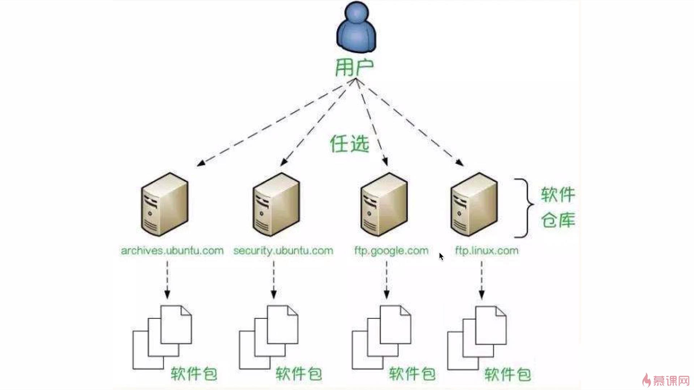

## 软件操作命令

-   软件包管理器：  yum
-   安装软件：     yum install   xxx
-   卸载软件：     yum remove xxxx
-   搜索软件：     yum serach   xxxx
-   清理缓存：      yum   cleam packages
-   列出已安装：   yum list
-   软件包信息：   yum  info  xxx

## 服务器硬件资源信息

-   内存： free -m
-   硬盘：  df   -h
-   负载：   w/top
-   cpu个数和  核数：

## 提权和文件上传下载操作

-   提权：  sudo     visudo
-   文件下载：  wget， curl
-   文件上传：  scp

-   date   当前时间
-   ls      当前目录下的文件和目录
-   ls -a    列出全部（包括隐藏文件）
-   ls    share    列出此目录下的文件
-   可以用Tab  来补全命令
-   补全文件名，路径名    两次Tab
-   ls  share/      share文件夹下的所有文件
-   向上键 ：按时间顺序向前查找用过的命令，每次前进一
-   向下键：  反之
-   Ctrl  +  R   查找使用过的命令
-   history：  命令输入历史
-   Ctrl + L   清理命令行屏幕
-   Ctrl +  D   向终端传递EOF （End of file ,  文件结束符）
-   Ctrl  +  A   光标移动到每行开头
-   Ctrl  +  E    光标跳到一行的结尾
-   Ctrl  +  U   删除光标左侧命令字符
-   Ctrl  +  K    删除右侧
-   Ctrl  +  W    删除光标左侧单词
-   Ctrl  +  U,   Ctrl  +  K, Ctrl  +  W  删除字符串，  Ctrl  +  Y  粘贴前面删除的字符串（类似剪切）

-   $表示普通用户
-   #为超级用户，无权限限制
-   sudo  su    进入root用户 超级用户
-   whoami     获取当前登陆用户
-   hostname      主机名称
-   exit    退出当前用户

## 文件目录

-   Linux  将所有东西放到一起

-   Linux 中，一切都是文件
-   目录也是文件

### 根目录

>   https:/linuxtoy.org/archives/linux-file-structure.html

-   只有一个根目录，  就是  / （斜杠）   ，为最高级目录
-   尽量用小写命名目录
-   bin  表示二进制 文件， 包含了所有的可执行程序
-   boot   启动     包含与Linux  启动密切相关的文件
-   etc    包含系统的配置文件，零碎的东西
-   home   用户的私人目录，  每个用户都在home 目录下有一个私人目录
-   假如我的用户名是oscar，那么我的私人目录就是/home/oscar
-   lib    library的缩写   表示“库”，  包含被程序所调用的库文件   以  .so  结尾
-   media   媒体，当一个可移动的外设（比如USB盘，SD卡，DVD，光盘等等）插入电脑时，Linux就可以让我们通过media的子目录来访问这些外设中的内容
-   mnt：英语mount的缩写，表示“挂载”。有点类似media，但一般用于临时挂载一些装置
-   opt：英语 optional application software package的缩写，表示“可选的应用软件包”。用于安装多数第三方软件和插件
-   root：英语“根”的意思。超级用户root的家目录/主目录。一般的用户的家目录是位于/home下，root用户是个例外
-   sbin：英语system binary的缩写，表示“系统二进制文件”。比起bin目录多了一个前缀system，包含的是系统级的重要可执行程序
-   srv：英语 service的缩写，表示“服务”。包含一些网络服务启动之后所需要取用的数据
-   tmp：英语temporary的缩写，表示“临时的"。普通用户和程序存放临时文件的地方
-   usr：是英语 Unix Software Resource的缩写，表示“Unix操作系统软件资源”（和etc目录一样，也是个历史遗留的命名）
-   usr目录是最庞大的目录之一。有点类似Windows中的C:\Windows和C:\Program Files 这两个文件夹的集合，usr 里面安装了大部分用户要调用的程序
-   var：英语 variable的缩写，表示“动态的，可变的"， var 通常包含程序的数据，比如log（日志）文件log文件记录电脑中发生了什么事
-   https:/linuxtoy.org/archives/linux-file-structure.html

-   pwd命令，   显示当前目录的路径   print  working  directory
-   which 命令 ：    获取命令的可执行文件的位置
-   ls  命令：  列出文件和目录       蓝色为目录    绿色为可执行文件       红色为压缩文件   浅蓝色为链接文件     灰色为其他文件
-   ls -a  显示所有文件目录，  包括隐藏的     . 开头的文件是隐藏的
-   ls ..   列出上级目录下的文件
-   ls  -l   列出详细列表  附带信息    权限    链接数量     所有者   所在群组     目录本身的大小       最近一次修改时间     文件名
-   ls -h     以K, M ,G 单位来表示大小
-   ls  -t    按照文件或目录    -t参数：按照文件或目录最近一次修改时间的降序排列Is的常用参数合并在一起使用，效果是叠加的：Is-lath

## 软件安装

-   以  .deb 作为软件包安装
-   软件包在软件仓库上
-   软件依赖其他程序

-   Ubuntu repository   软件源

### 软件下载

-   sudo apt-get  install   xxxxx    安装软件
-   aptitude   卸载软件
-   sudo apt-get update    软件更新
-   apt-cache search   搜索软件包
-   apt-get upgrade   升级所有已经安装的软件包
-   dpkg      用于安装在网上下载到本地的软件包，类似在window中的安装
-   sudo dpkg -i *.deb   安装
-   sudo dpkg -r 包名   卸载
-   flatpak install *win*
-   flatpak install *bai*