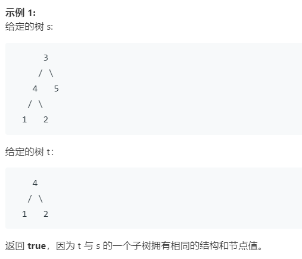
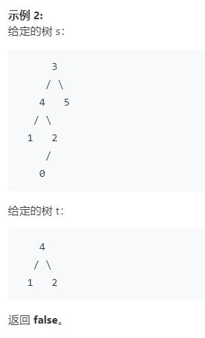

## 572.  另一个树的子树

给定两个非空二叉树 s 和 t，检验 s 中是否包含和 t 具有相同结构和节点值的子树。s 的一个子树包括 s 的一个节点和这个节点的所有子孙。s 也可以看做它自身的一棵子树。





### my answer:  error

```java
/**
 * Definition for a binary tree node.
 * public class TreeNode {
 *     int val;
 *     TreeNode left;
 *     TreeNode right;
 *     TreeNode(int x) { val = x; }
 * }
 */
class Solution {

    int count = 0;
    public boolean isSubtree(TreeNode s, TreeNode t) {
        
        if(s == null && t != null)
            return false;
        else if(s != null && t == null)
            return false;
        else if(s == null && t == null)
            return true;

        if( s.val == t.val && count != 0){

            return isSubtree(s.left, t.left) && isSubtree(s.right, t.right);
        }
        else if(s.val == t.val && count == 0)
            return isSubtree(s.left, t) && isSubtree(s.right, t);
        else{
            count ++;
            return isSubtree(s.left, t) || isSubtree(s.right, t);
            //isSubtree(s.right, t);
        }
    }
}
```

### answer

考虑递归解法，则首先考虑如何分解问题。
题目给出s和t两树，让我们求解t是不是s的子树，那么：

t就等于s本身
t是s的左子树的子树
t是s的右子树的子树

```
return isEqual(s,t) || isSubtree(s.left, t) || isSubtree(s.right, t);
```

也就是递归体在于以上三步，因此，根据第一点，我们需要一个判断两树相等的函数（同样使用递归）

也就是递归体在于以上三步，因此，根据第一点，我们需要一个判断两树相等的函数（同样使用递归）

问题变成：我们如何判断两树（l、r）相等呢？

-   根节点值相等

-   l的左子树和r的左子树相等

-   l的右子树和r的右子树相等

    ```
    if(l.val == r.val)
        return isEqual(l.left,r.left) && isEqual(l.right,r.right);
    ```


    以下是完整代码：

```java
    /**
    * 判断两树是否相等
    * @param l
    * @param r
    * @return
    */
private boolean isEqual(TreeNode l, TreeNode r){
    if(l == null && r == null) return true;//两树均空自然相等
    if(l == null || r == null) return false;//一空一非空，自然不等
    if(l.val == r.val)//递归判断
        return isEqual(l.left,r.left) && isEqual(l.right,r.right);
    return false;
}

    /**
    * 判断 t 树是否是 s 树的子树
    * @param s
    * @param t
    * @return
    */
public boolean isSubtree(TreeNode s, TreeNode t) {
    if(s == null && t == null)
        return true;
    if(s == null || t == null) return false;
    if(s.val == t.val){
        return isEqual(s,t) || isSubtree(s.left, t) || isSubtree(s.right, t);
    }
    // 根节点不同，那么就不同考虑s和t相等的情形了
    return isSubtree(s.left, t) || isSubtree(s.right, t);
}
```


 ## 100. 相同的树


```java
/**
 * Definition for a binary tree node.
 * public class TreeNode {
 *     int val;
 *     TreeNode left;
 *     TreeNode right;
 *     TreeNode(int x) { val = x; }
 * }
 */
class Solution {
    public boolean isSameTree(TreeNode p, TreeNode q) {
        if(p != null && q == null)
            return false;
        else if(p == null && q != null)
            return false;
        else if(p == null && q == null)
            return true;
        if(p.val == q.val)
            return isSameTree(p.left, q.left) && isSameTree(p.right, q.right);
        else
            return false;    
    }
}
```


第一次100%哎，好高兴，可能题太简单了